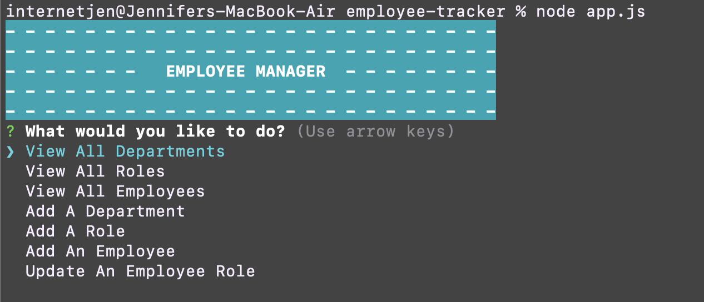
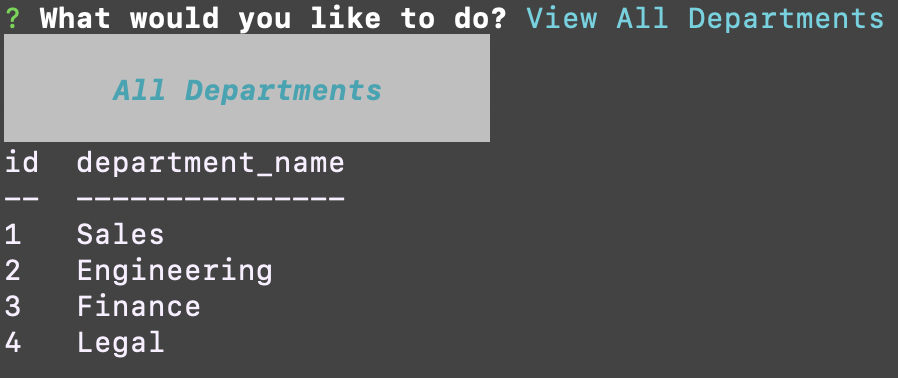
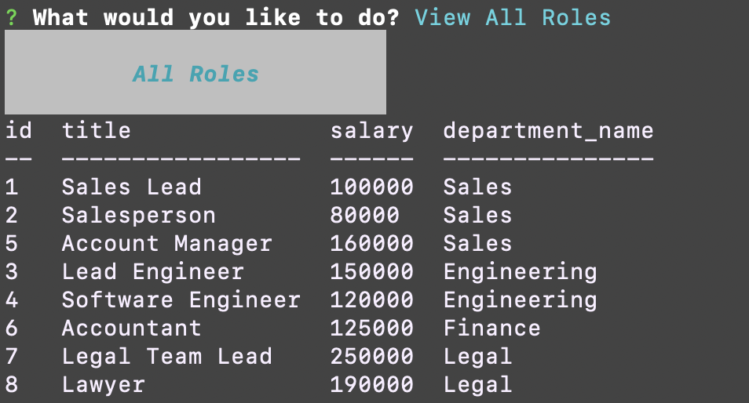
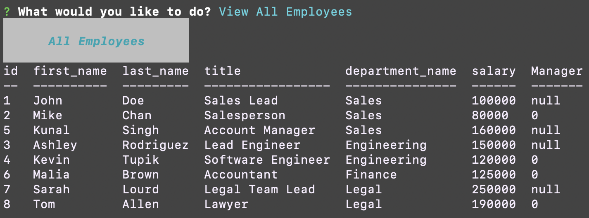

# Employee Tracker Slay

  ## Description
  A command-line application to manage a company's employee database using Node.js, Inquirer, and MySQL2, Chalk, and Console.Table.

  Employee Tracker Slay allows a user to manage employee information in a company database. The user can view the departments, roles, employees and their details such as the salary, department and manager they report to. They can also add to and edit the database by adding new departments, roles, employees and update the role of an employee.

  ## Table of Contents
  * [Prerequisites](#prerequisites)
  * [Installation](#installing)
  * [Usage](#usage)
  * [License](#license)
  * [Questions](#questions)

  ## Getting Started

  ### Prerequisites
  * In order to run the app, you'll need to have [Node.js](https://nodejs.org/en/download/) and [npm](https://docs.npmjs.com/about-npm) installed on your local machine.

  ### Installing
  * Clone the repository to your local machine.
  * Open the terminal and navigate to the project directory.
  * Run `npm install` to install all the required packages.
  * Run the app by typing `node app.js` or `npm start` in the terminal.

  ## Usage

  ### App Functionality
  * Running the app prompts user with options on what to do next: 

  

  * View All Departments - displays a table of all departments with their id.
  
  

  * View All Roles - displays a table of all roles with the job title, role id, the department that role belongs to, and the salary.

  

  * View All Employees - displays a table of all employees with their ids, first names, last names, job titles, departments, salaries, and managers that the employees report to.
  
  

  * Add A Department - allows you to add a new department.
  
  

  * Add A Role - allows you to add a new role.

  

  * Add An Employee - allows you to add a new employee.

  

  * Update An Employee Role - allows you to update the role of an employee.

  

  ### Walk-through Video
  To see all of these in action, take a look at this video.
  

  ## License
  N/A

  ## Questions
  For inquiries, please email me at arboleda.jen@gmail.com or visit my [GitHub](https://github.com/internetjen)
